# Screenshot Guide

Tài liệu này mô tả các page chính của dự án **appointment-booking** dựa trên:

- bộ ảnh đã chụp trong thư mục `.playwright-mcp/`
- cấu trúc route trong `src/app/**/page.tsx`
- mô tả chức năng từ spec trong `specs/001-appointment-booking/`

Mục tiêu của file là giúp đọc nhanh toàn bộ giao diện hiện có, biết mỗi màn hình dùng để làm gì, và đối chiếu giữa route thực tế với screenshot đã chụp.

## Tổng quan coverage

- Tổng số page route trong dự án: **31**
- Tổng số screenshot đã chụp: **27**
- Các nhóm màn hình đã có ảnh: **public**, **auth**, **patient**, **provider**, **receptionist**, **admin**
- Một số route động hoặc route trùng entry point hiện **chưa có ảnh riêng**; chi tiết ở phần cuối tài liệu.

## Thư mục screenshot

Các ảnh đang được lưu tại:

- `.playwright-mcp/public-home.png`
- `.playwright-mcp/public-doctor-profile.png`
- `.playwright-mcp/public-book-doctor.png`
- `.playwright-mcp/public-book-waitlist.png`
- `.playwright-mcp/auth-login.png`
- `.playwright-mcp/auth-forgot-password.png`
- `.playwright-mcp/auth-reset-password.png`
- `.playwright-mcp/auth-register.png`
- `.playwright-mcp/auth-verify-pending.png`
- `.playwright-mcp/patient-my-appointments.png`
- `.playwright-mcp/patient-appointment-detail.png`
- `.playwright-mcp/patient-my-dependents.png`
- `.playwright-mcp/patient-my-invoices.png`
- `.playwright-mcp/patient-my-profile.png`
- `.playwright-mcp/patient-notification-preferences.png`
- `.playwright-mcp/provider-dashboard.png`
- `.playwright-mcp/provider-today.png`
- `.playwright-mcp/provider-patients.png`
- `.playwright-mcp/provider-profile.png`
- `.playwright-mcp/receptionist-day-view.png`
- `.playwright-mcp/receptionist-walk-in.png`
- `.playwright-mcp/admin-schedules.png`
- `.playwright-mcp/admin-appointments.png`
- `.playwright-mcp/admin-users.png`
- `.playwright-mcp/admin-reports.png`
- `.playwright-mcp/admin-audit-log.png`
- `.playwright-mcp/admin-settings.png`

## Public pages

### Trang chủ / landing

- **Route:** `/`
- **Screenshot:** `public-home.png`
- **Mục đích:** trang public chính của hệ thống đặt lịch khám.
- **Preview:**

  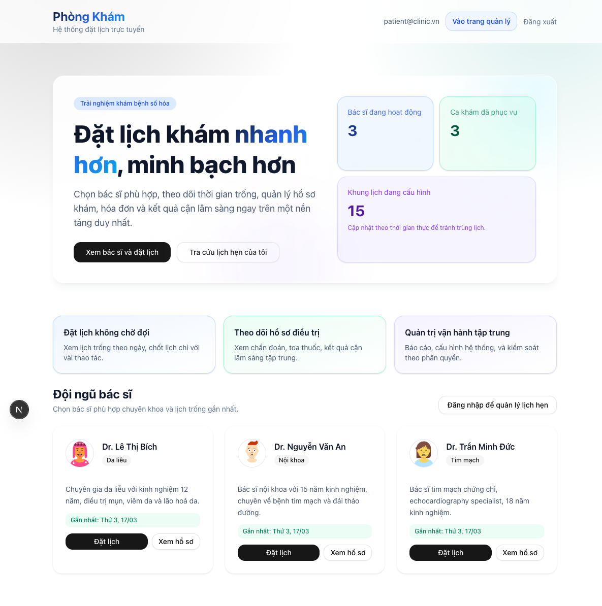

- **Nội dung chính:**
  - header của hệ thống `Phòng Khám`
  - hero giới thiệu đặt lịch trực tuyến
  - danh sách bác sĩ đang hoạt động
  - link điều hướng đến đăng nhập hoặc trang quản lý theo vai trò nếu đã đăng nhập
- **Theo spec:** đây là entry point cho user story đặt lịch, cho phép người dùng duyệt danh sách bác sĩ trước khi chọn lịch.

### Section danh sách bác sĩ

- **Route/Anchor:** `/#doctors`
- **Screenshot:** `public-home.png`
- **Mục đích:** section danh sách bác sĩ nằm ngay trên trang chủ, là nơi người dùng kéo xuống để chọn bác sĩ và bắt đầu đặt lịch.
- **Preview:**

  

- **Nội dung chính:**
  - tiêu đề `Đội ngũ bác sĩ`
  - danh sách các bác sĩ đang hoạt động
  - thẻ bác sĩ hiển thị chuyên khoa và lịch trống gần nhất
  - CTA dẫn tới đăng nhập hoặc flow booking
- **Theo code:** trong `src/app/(public)/page.tsx`, phần danh sách bác sĩ được render ở `<section id='doctors'>...</section>`.

### Hồ sơ bác sĩ công khai

- **Route:** `/doctors/[id]`
- **Screenshot:** `public-doctor-profile.png`
- **Mục đích:** xem thông tin chi tiết của một bác sĩ trước khi đặt lịch.
- **Preview:**

  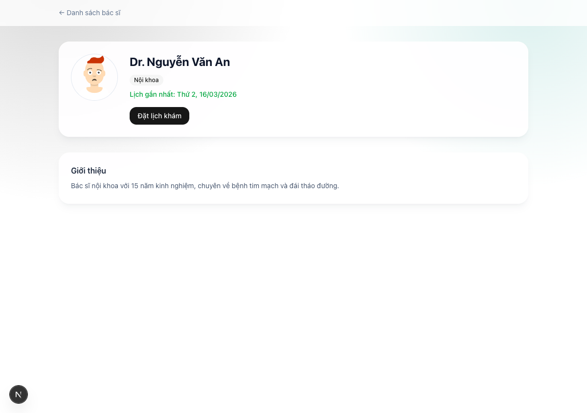

- **Nội dung chính:**
  - thông tin nhận diện bác sĩ: tên, chuyên khoa, ảnh đại diện
  - phần bio, bằng cấp, ngôn ngữ, phí khám nếu có
  - đánh giá/tổng hợp review
  - CTA để đặt lịch hoặc tham gia waitlist
- **Theo spec:** đây là màn public profile giúp bệnh nhân ra quyết định trước khi đi vào flow booking.

### Đặt lịch với bác sĩ

- **Route:** `/book/[doctorId]`
- **Screenshot:** `public-book-doctor.png`
- **Mục đích:** màn hình booking chính cho một bác sĩ cụ thể.
- **Preview:**

  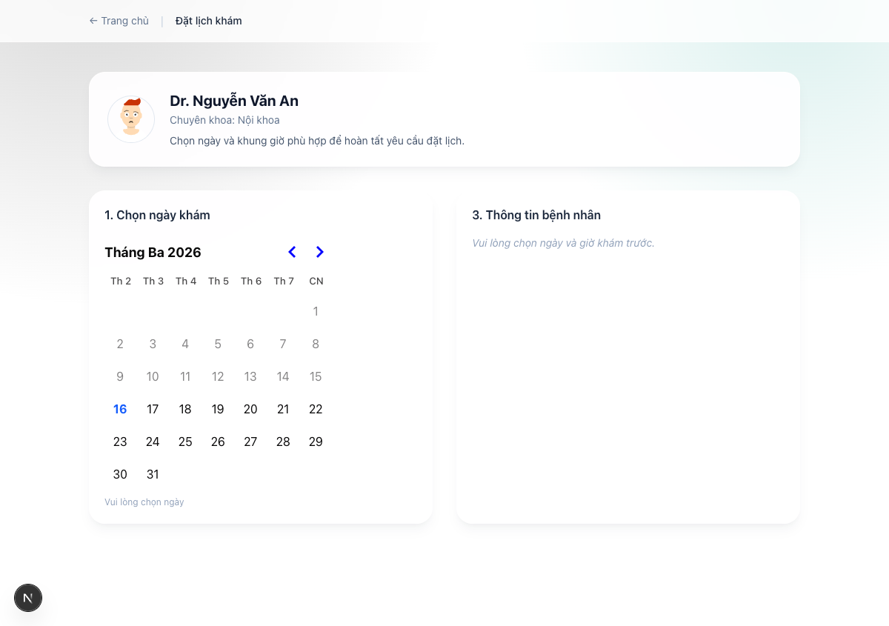

- **Nội dung chính:**
  - phần tóm tắt bác sĩ ở đầu trang
  - lịch/chọn slot khám
  - form đặt lịch
  - điều hướng quay về trang chủ
- **Theo spec:** đây là page trung tâm của luồng đặt lịch, kết hợp slot picker và booking form.

### Tham gia danh sách chờ

- **Route:** `/book/[doctorId]/waitlist`
- **Screenshot:** `public-book-waitlist.png`
- **Mục đích:** cho bệnh nhân đăng ký nhận suất trống khi bác sĩ chưa có slot phù hợp.
- **Preview:**

  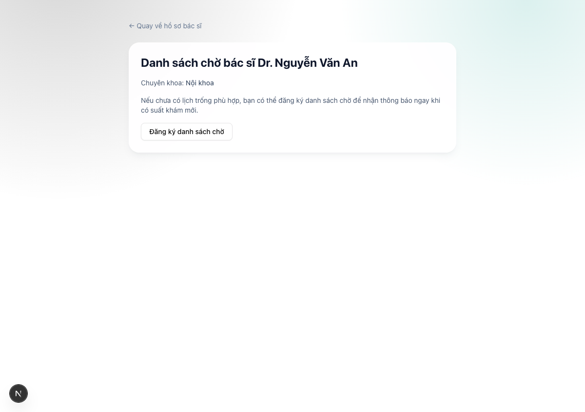

- **Nội dung chính:**
  - thông tin bác sĩ liên quan
  - form tham gia waitlist
  - hành động gửi yêu cầu chờ
- **Theo spec:** page này hỗ trợ trường hợp không còn lịch phù hợp nhưng user vẫn muốn được ưu tiên khi có chỗ trống.

### Route chuyển hướng tới danh sách bác sĩ

- **Route:** `/book`
- **Screenshot riêng:** không cần ảnh riêng
- **Mục đích:** route trung gian đưa người dùng tới section danh sách bác sĩ trên trang chủ.
- **Ghi chú:** trong `src/app/(public)/book/page.tsx`, route này chỉ thực hiện `redirect("/#doctors")`, nên không phải một page giao diện độc lập.

## Authentication pages

### Đăng nhập

- **Route:** `/auth/login`
- **Screenshot:** `auth-login.png`
- **Mục đích:** xác thực người dùng bằng email và mật khẩu.
- **Preview:**

  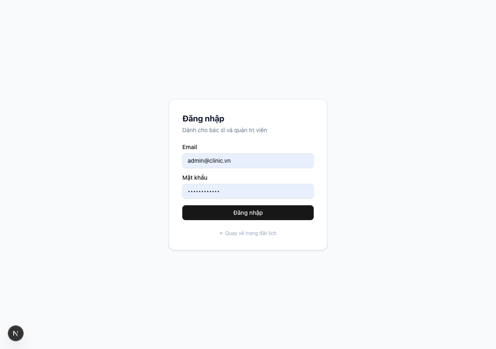

- **Nội dung chính:**
  - form đăng nhập
  - chuyển hướng theo vai trò sau khi đăng nhập thành công
  - liên kết đến quên mật khẩu
- **Theo spec:** route login dùng chung cho nhiều vai trò như patient, provider, admin, receptionist.

### Quên mật khẩu

- **Route:** `/auth/forgot-password`
- **Screenshot:** `auth-forgot-password.png`
- **Mục đích:** gửi yêu cầu đặt lại mật khẩu qua email.
- **Preview:**

  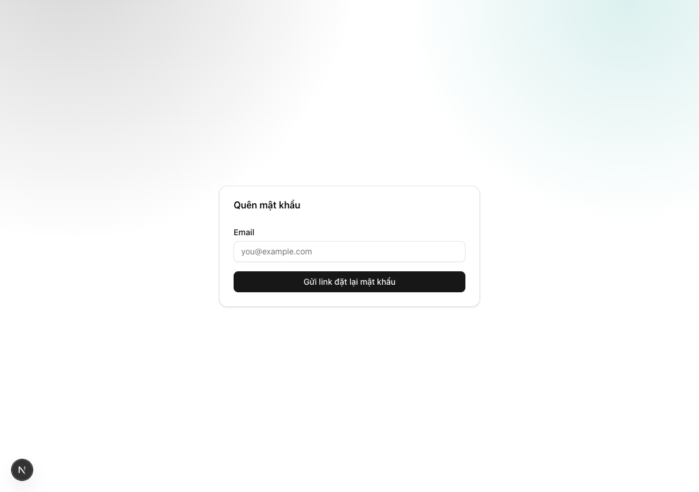

- **Nội dung chính:**
  - nhập email
  - gửi yêu cầu reset
  - phản hồi trạng thái thao tác

### Đặt lại mật khẩu

- **Route:** `/auth/reset-password`
- **Screenshot:** `auth-reset-password.png`
- **Mục đích:** cập nhật mật khẩu mới sau khi người dùng đi từ email reset.
- **Preview:**

  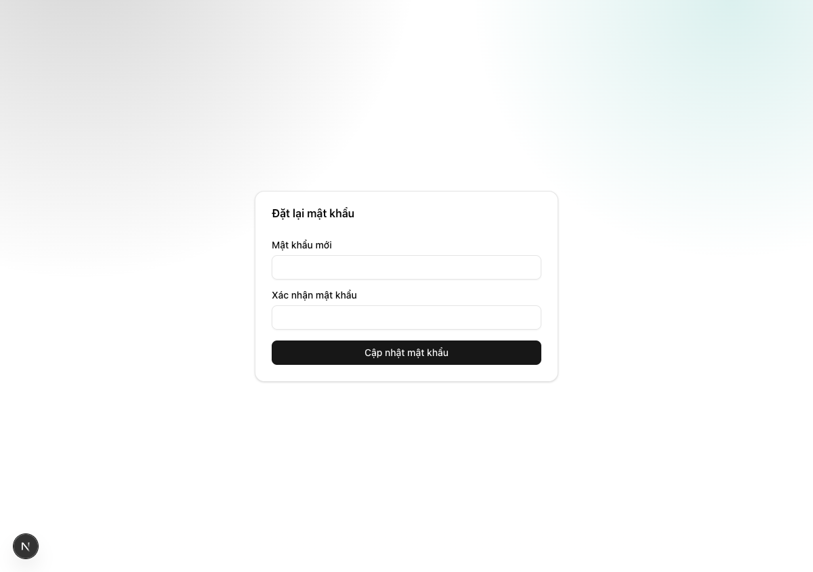

- **Nội dung chính:**
  - nhập mật khẩu mới
  - xác nhận mật khẩu
  - hoàn tất quá trình reset

### Đăng ký tài khoản bệnh nhân

- **Route:** `/auth/register`
- **Screenshot:** `auth-register.png`
- **Mục đích:** cho bệnh nhân tạo tài khoản mới.
- **Preview:**

  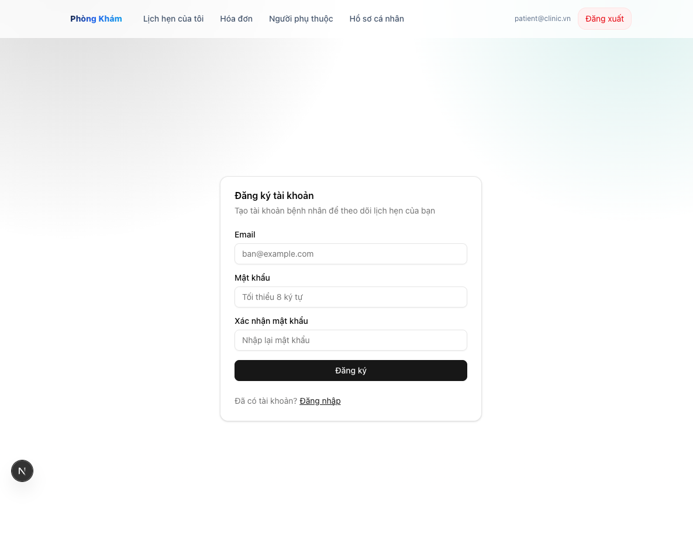

- **Nội dung chính:**
  - form đăng ký bằng email và mật khẩu
  - validate dữ liệu đầu vào
  - thông báo yêu cầu xác minh email
- **Theo spec:** tài khoản mới được tạo với role `patient`.

### Chờ xác minh email

- **Route:** `/auth/verify-pending`
- **Screenshot:** `auth-verify-pending.png`
- **Mục đích:** thông báo tài khoản chưa xác minh và hỗ trợ gửi lại email xác minh.
- **Preview:**

  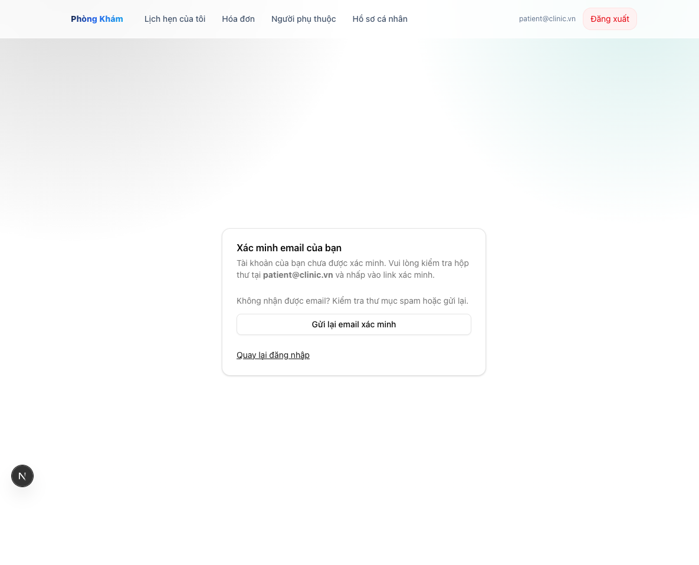

- **Nội dung chính:**
  - hiển thị email đang chờ xác minh
  - nút gửi lại email xác minh
  - liên kết quay về đăng nhập
- **Theo spec:** bệnh nhân chưa verify email sẽ bị điều hướng đến page này.

## Patient pages

Các page patient dùng layout riêng với các mục điều hướng như lịch hẹn, hóa đơn, người phụ thuộc và hồ sơ cá nhân.

### Danh sách lịch hẹn của tôi

- **Route:** `/my-appointments`
- **Screenshot:** `patient-my-appointments.png`
- **Mục đích:** nơi bệnh nhân xem tất cả lịch hẹn của mình.
- **Preview:**

  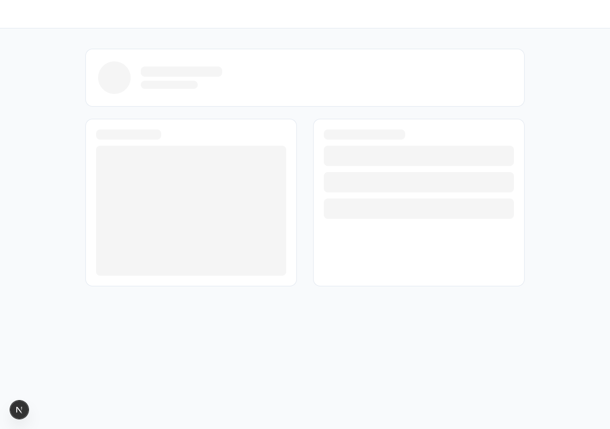

- **Nội dung chính:**
  - danh sách lịch hẹn theo trạng thái
  - thông tin bác sĩ, thời gian khám
  - link xem chi tiết từng lịch hẹn

### Chi tiết lịch hẹn

- **Route:** `/my-appointments/[id]`
- **Screenshot:** `patient-appointment-detail.png`
- **Mục đích:** xem đầy đủ thông tin một lịch hẹn cụ thể.
- **Preview:**

  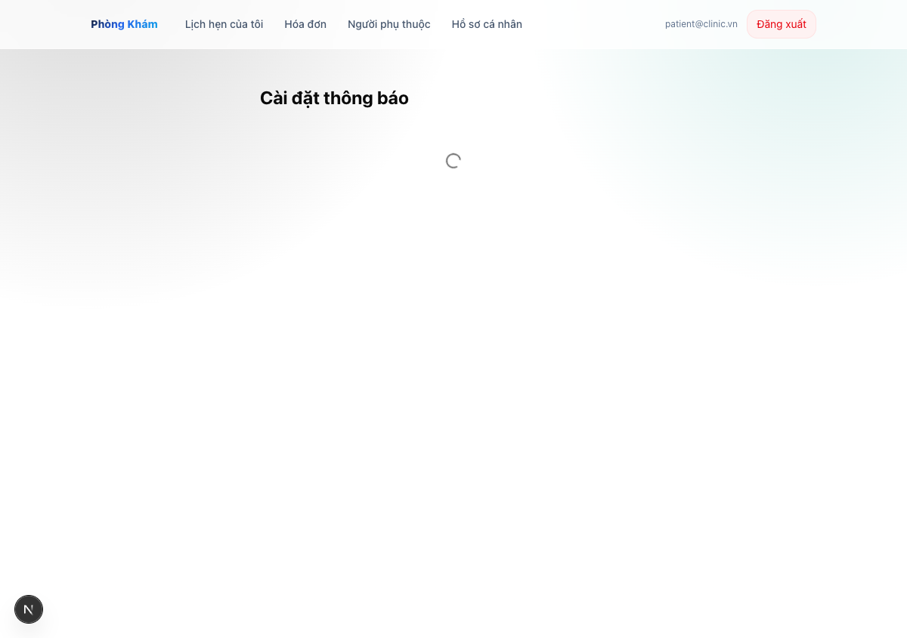

- **Nội dung chính:**
  - thông tin lịch hẹn, bác sĩ, lý do khám
  - trạng thái lịch hẹn
  - hồ sơ khám, đơn thuốc, chỉ định xét nghiệm nếu có
- **Theo spec/code:** đây là màn patient xem sâu dữ liệu lâm sàng sau buổi khám.

### Đổi lịch hẹn

- **Route:** `/my-appointments/[id]/reschedule`
- **Screenshot riêng:** chưa có
- **Mục đích:** cho phép đổi lịch hẹn nếu trạng thái còn hợp lệ.
- **Ghi chú:** trong lần chụp gần nhất, route này redirect theo dữ liệu thực tế nên chưa lấy được ảnh độc lập.

### Quản lý người phụ thuộc

- **Route:** `/my-dependents`
- **Screenshot:** `patient-my-dependents.png`
- **Mục đích:** quản lý hồ sơ người phụ thuộc để đặt lịch thay mặt.
- **Preview:**

  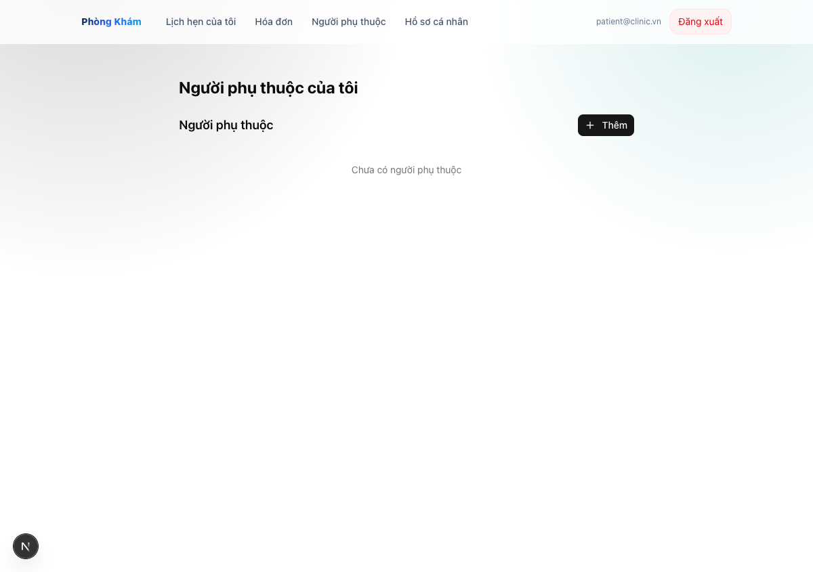

- **Nội dung chính:**
  - danh sách người phụ thuộc
  - thêm/sửa thông tin cơ bản
  - hỗ trợ luồng đặt lịch cho người thân

### Hóa đơn của tôi

- **Route:** `/my-invoices`
- **Screenshot:** `patient-my-invoices.png`
- **Mục đích:** xem danh sách hóa đơn liên quan đến các lần khám.
- **Preview:**

  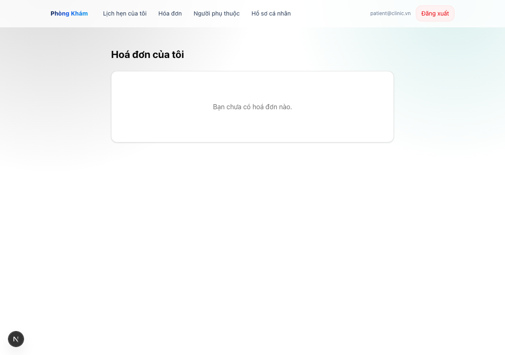

- **Nội dung chính:**
  - bảng hoặc danh sách hóa đơn
  - trạng thái thanh toán
  - thông tin số tiền và ngày phát sinh

### Hồ sơ cá nhân

- **Route:** `/my-profile`
- **Screenshot:** `patient-my-profile.png`
- **Mục đích:** cho bệnh nhân cập nhật thông tin tài khoản và hồ sơ cơ bản.
- **Preview:**

  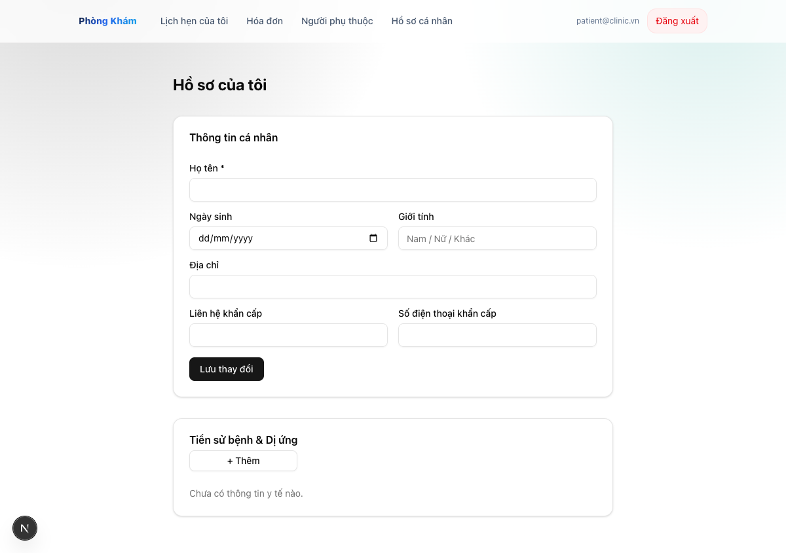

- **Nội dung chính:**
  - thông tin liên hệ
  - dữ liệu cá nhân liên quan hồ sơ bệnh nhân
  - các thiết lập tài khoản cơ bản

### Tùy chọn thông báo

- **Route:** `/my-profile/notification-preferences`
- **Screenshot:** `patient-notification-preferences.png`
- **Mục đích:** cấu hình cách nhận nhắc lịch và thông báo.
- **Preview:**

  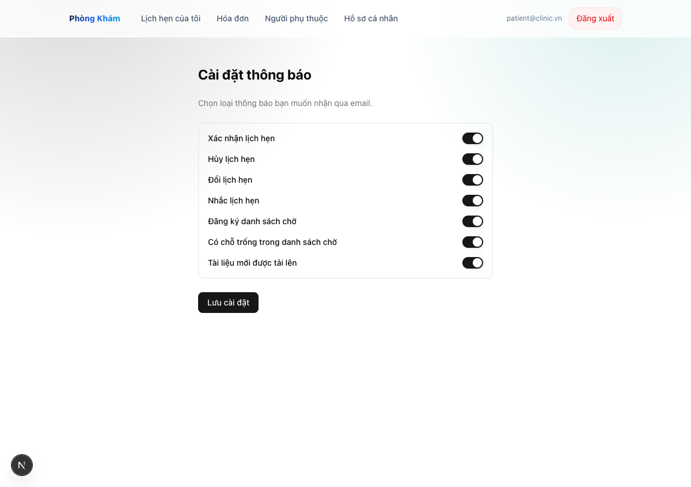

- **Nội dung chính:**
  - bật/tắt các loại thông báo
  - tuỳ chọn kênh nhận thông tin nếu có

## Provider pages

Các page provider nằm trong dashboard dành cho bác sĩ, có sidebar riêng với các mục tổng quan, lịch hôm nay, bệnh nhân và hồ sơ cá nhân.

### Dashboard tổng quan bác sĩ

- **Route:** `/dashboard`
- **Screenshot:** `provider-dashboard.png`
- **Mục đích:** màn hình tổng quan để bác sĩ quản lý lịch hẹn của mình.
- **Preview:**

  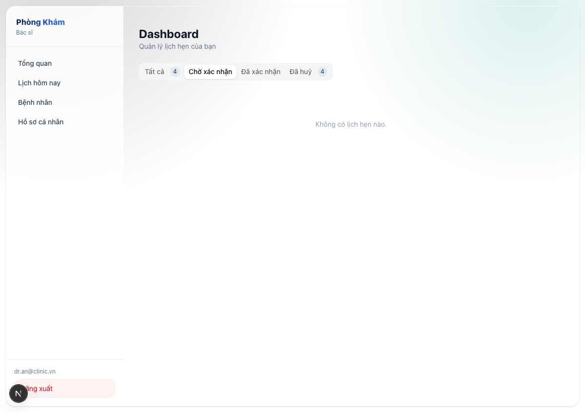

- **Nội dung chính:**
  - danh sách lịch hẹn ban đầu của bác sĩ
  - trạng thái lịch hẹn
  - hành động xử lý phù hợp theo workflow
- **Theo code/spec:** nếu tài khoản chưa liên kết với `doctor_id`, page sẽ hiển thị thông báo liên hệ quản trị viên.

### Lịch hôm nay

- **Route:** `/dashboard/today`
- **Screenshot:** `provider-today.png`
- **Mục đích:** theo dõi hàng đợi khám trong ngày.
- **Preview:**

  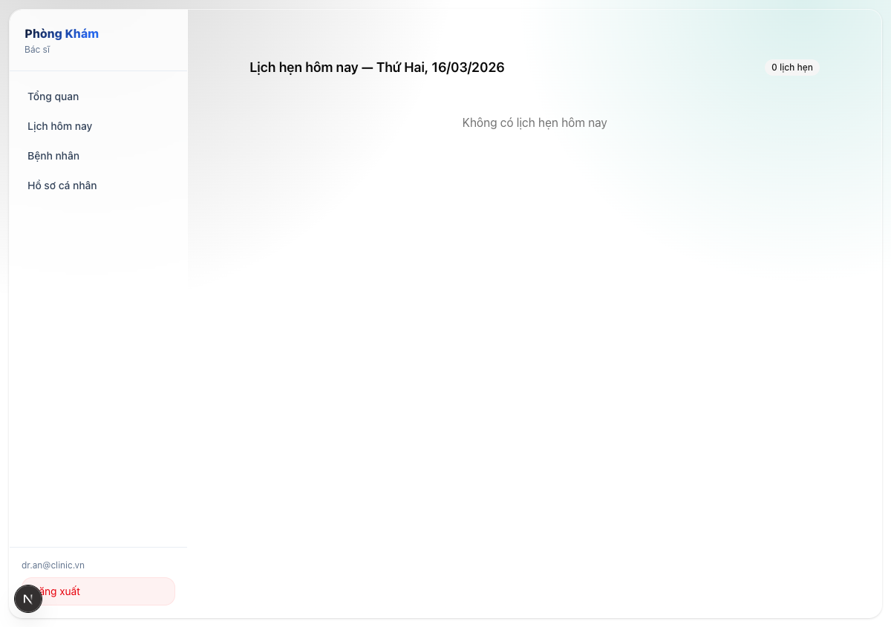

- **Nội dung chính:**
  - danh sách bệnh nhân hôm nay
  - trạng thái `pending`, `confirmed`, `completed`, `cancelled`, `no-show`
  - thao tác nhanh theo từng lịch
- **Theo component:** đây là màn giúp bác sĩ thấy tình trạng buổi khám theo thời gian thực.

### Danh sách bệnh nhân

- **Route:** `/dashboard/patients`
- **Screenshot:** `provider-patients.png`
- **Mục đích:** xem danh sách bệnh nhân đã từng khám với bác sĩ.
- **Preview:**

  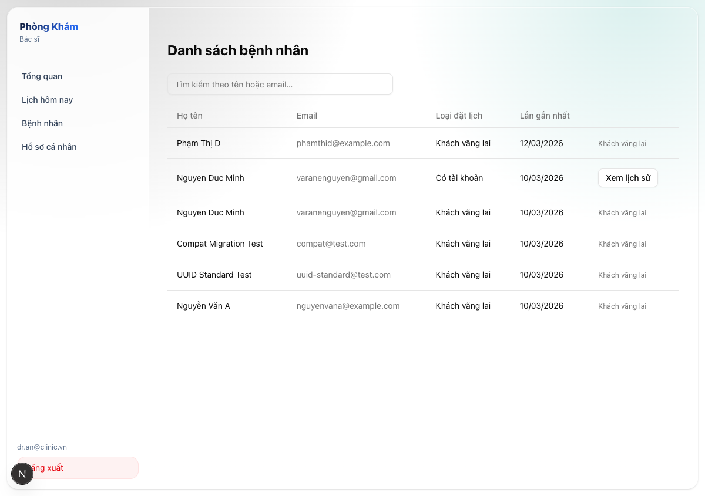

- **Nội dung chính:**
  - bảng bệnh nhân
  - loại bệnh nhân: có tài khoản hoặc khách vãng lai
  - lần khám gần nhất
  - link xem lịch sử khám

### Lịch sử bệnh nhân

- **Route:** `/dashboard/patients/[patientId]`
- **Screenshot riêng:** chưa có
- **Mục đích:** xem lịch sử khám của một bệnh nhân cụ thể dưới góc nhìn bác sĩ.
- **Nội dung chính theo code:**
  - danh sách appointment giữa bác sĩ và bệnh nhân đó
  - medical record, prescription items, lab orders
- **Ghi chú:** đây là một route động quan trọng nhưng chưa được chụp ảnh riêng trong bộ hiện tại.

### Hồ sơ bác sĩ

- **Route:** `/dashboard/profile`
- **Screenshot:** `provider-profile.png`
- **Mục đích:** quản lý thông tin cá nhân/chuyên môn của bác sĩ.
- **Preview:**

  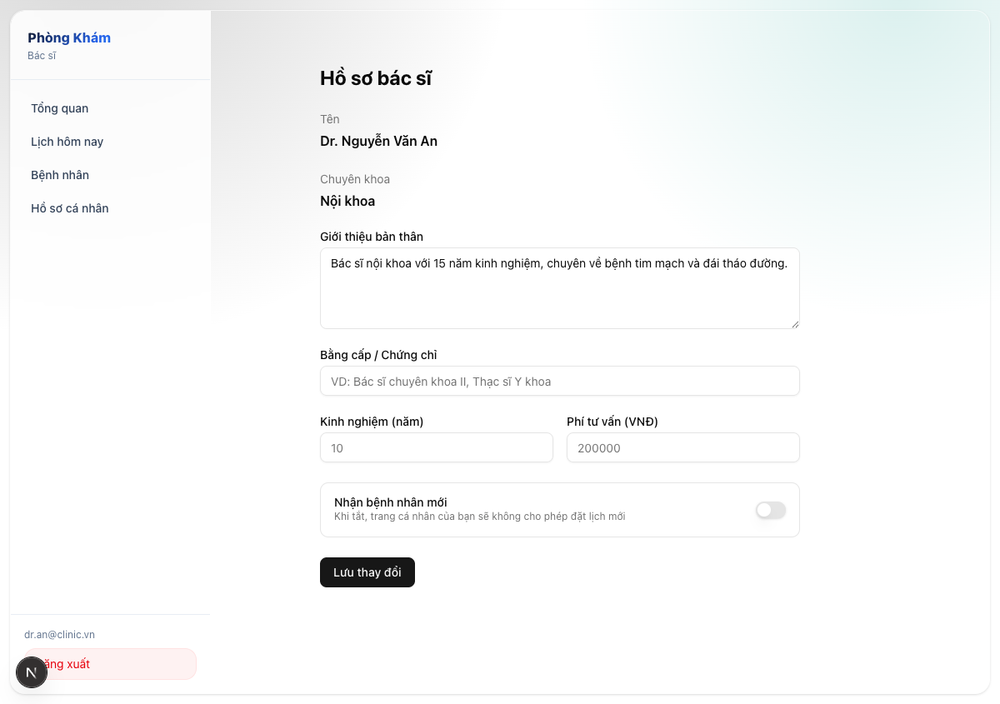

- **Nội dung chính:**
  - hồ sơ hiển thị cho hệ thống hoặc cho bệnh nhân
  - thông tin chuyên khoa và dữ liệu liên quan

## Receptionist pages

Các page lễ tân phục vụ vận hành trong ngày và tiếp nhận bệnh nhân đến trực tiếp.

### Day view / lịch trong ngày

- **Route:** `/receptionist/day-view`
- **Screenshot:** `receptionist-day-view.png`
- **Mục đích:** màn hình vận hành chính cho lễ tân theo dõi toàn bộ queue trong ngày.
- **Preview:**

  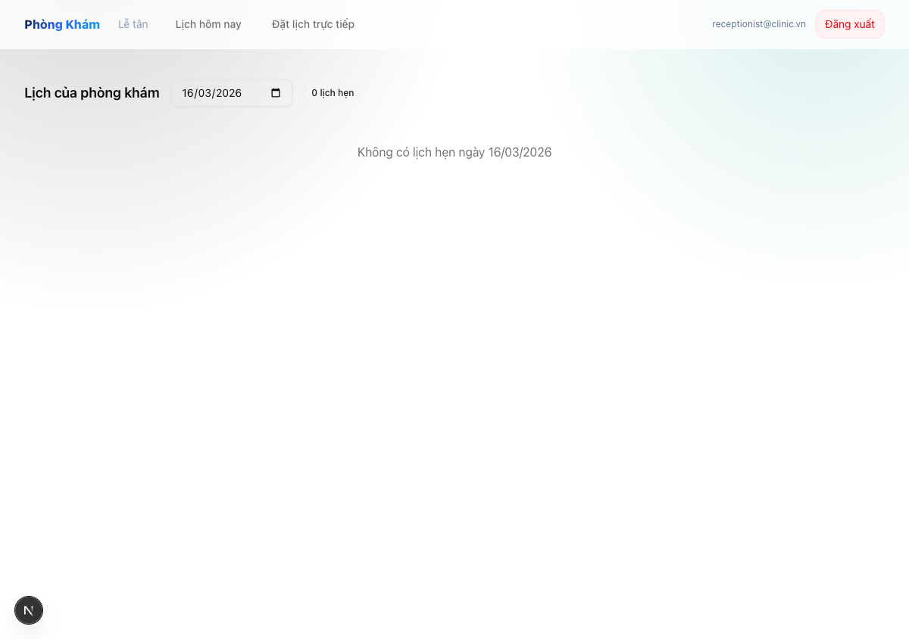

- **Nội dung chính:**
  - date picker
  - danh sách lịch theo từng bác sĩ
  - trạng thái màu cho từng cuộc hẹn
  - hành động check-in
- **Theo spec:** hiển thị chỉ số đã check-in theo từng bác sĩ và cập nhật realtime.

### Đăng ký khám trực tiếp / walk-in

- **Route:** `/receptionist/walk-in`
- **Screenshot:** `receptionist-walk-in.png`
- **Mục đích:** tạo lịch hẹn cho bệnh nhân đến trực tiếp tại quầy.
- **Preview:**

  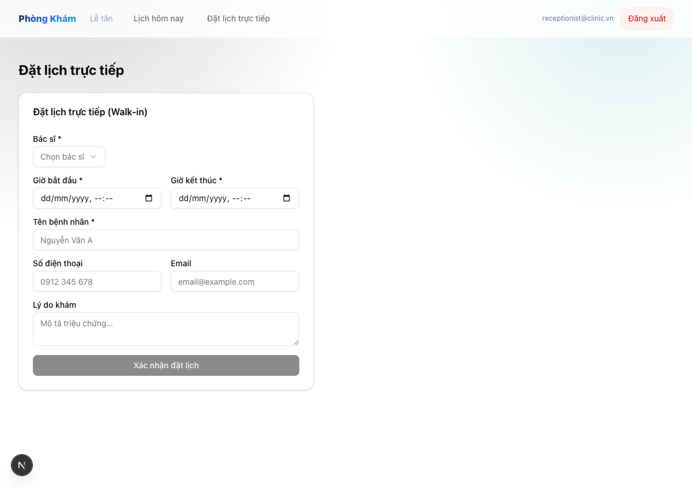

- **Nội dung chính:**
  - chọn bác sĩ/khung giờ
  - nhập thông tin bệnh nhân không cần tài khoản
  - tạo cuộc hẹn từ phía lễ tân
- **Theo spec:** route này dùng flow tương tự booking nhưng dành cho lễ tân thao tác nội bộ.

## Admin pages

Các page admin dùng sidebar riêng với các mục lịch làm việc, lịch hẹn, người dùng, báo cáo, nhật ký và cài đặt.

### Quản lý lịch làm việc

- **Route:** `/admin/schedules`
- **Screenshot:** `admin-schedules.png`
- **Mục đích:** cấu hình lịch làm việc cho bác sĩ.
- **Preview:**

  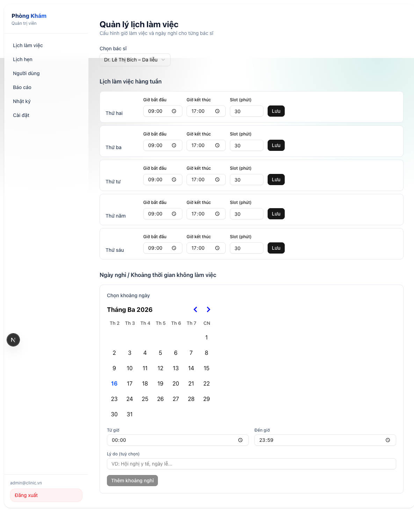

- **Nội dung chính:**
  - chọn bác sĩ
  - cấu hình ngày làm việc, giờ làm việc, ngày nghỉ hoặc block time
- **Theo code/spec:** đây là màn nền tảng để booking chỉ hiển thị slot hợp lệ.

### Quản lý lịch hẹn

- **Route:** `/admin/appointments`
- **Screenshot:** `admin-appointments.png`
- **Mục đích:** admin theo dõi và quản trị lịch hẹn toàn hệ thống.
- **Preview:**

  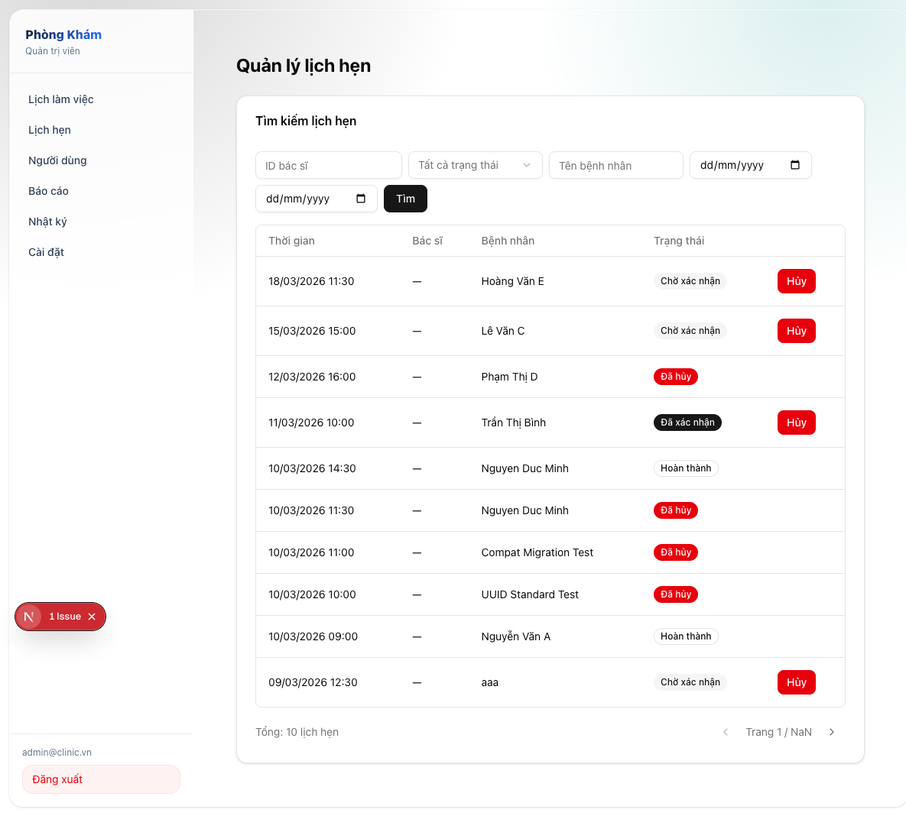

- **Nội dung chính:**
  - danh sách appointments
  - tìm kiếm/lọc hoặc xử lý trạng thái ở cấp quản trị

### Quản lý người dùng

- **Route:** `/admin/users`
- **Screenshot:** `admin-users.png`
- **Mục đích:** quản lý provider và danh mục dịch vụ.
- **Preview:**

  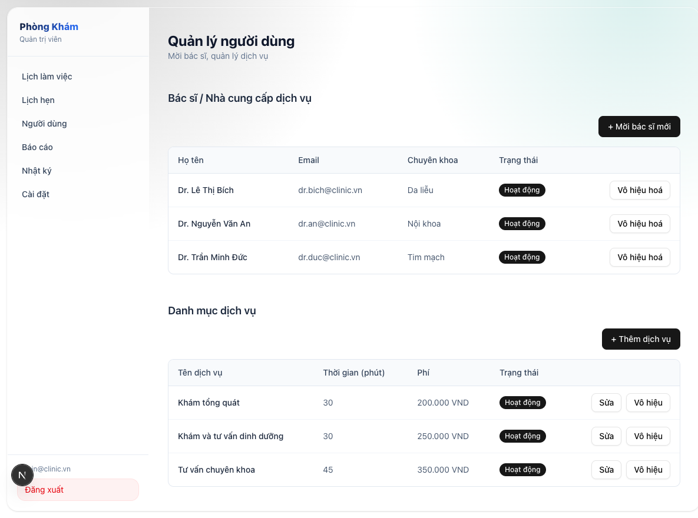

- **Nội dung chính:**
  - bảng bác sĩ/provider
  - mời mới hoặc vô hiệu hóa provider
  - quản lý service catalogue
- **Theo spec:** hỗ trợ invite provider và quản lý dịch vụ khám.

### Báo cáo và thống kê

- **Route:** `/admin/reports`
- **Screenshot:** `admin-reports.png`
- **Mục đích:** xem và xuất báo cáo vận hành/doanh thu.
- **Preview:**

  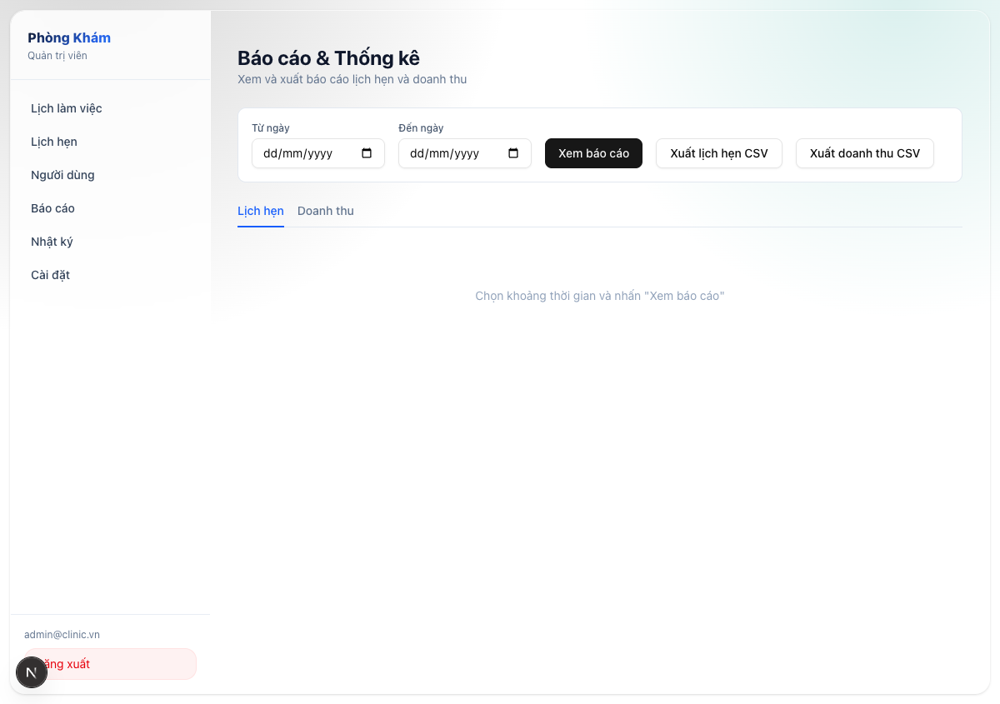

- **Nội dung chính:**
  - bộ lọc khoảng ngày
  - tab báo cáo lịch hẹn và doanh thu
  - nút export CSV
- **Theo spec:** đây là trang tổng hợp số liệu cho admin.

### Nhật ký hệ thống

- **Route:** `/admin/audit-log`
- **Screenshot:** `admin-audit-log.png`
- **Mục đích:** theo dõi log thao tác hệ thống phục vụ audit.
- **Preview:**

  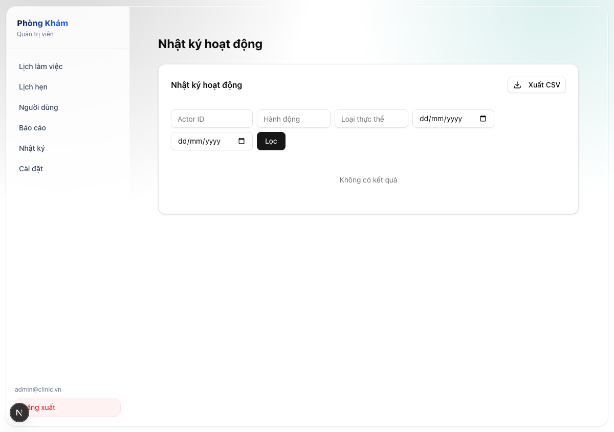

- **Nội dung chính:**
  - danh sách sự kiện
  - actor, thời gian, hành động, đối tượng liên quan

### Cài đặt hệ thống

- **Route:** `/admin/settings`
- **Screenshot:** `admin-settings.png`
- **Mục đích:** cấu hình các thông số chung của hệ thống.
- **Preview:**

  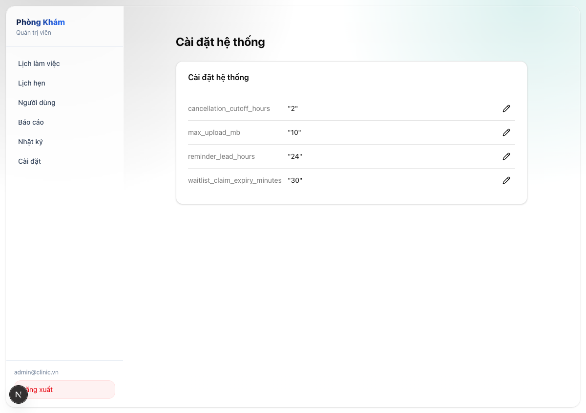

- **Nội dung chính:**
  - các thiết lập mức hệ thống hoặc phòng khám
  - tham số vận hành, thông báo, hoặc quy tắc nghiệp vụ nếu được hỗ trợ

# Mail pages

Các page liên quan đến việc xác nhận đặt lịch qua email, huỷ lịch,

- **Mục đích:**: Xác nhận đặt lịch
- **Preview:**

  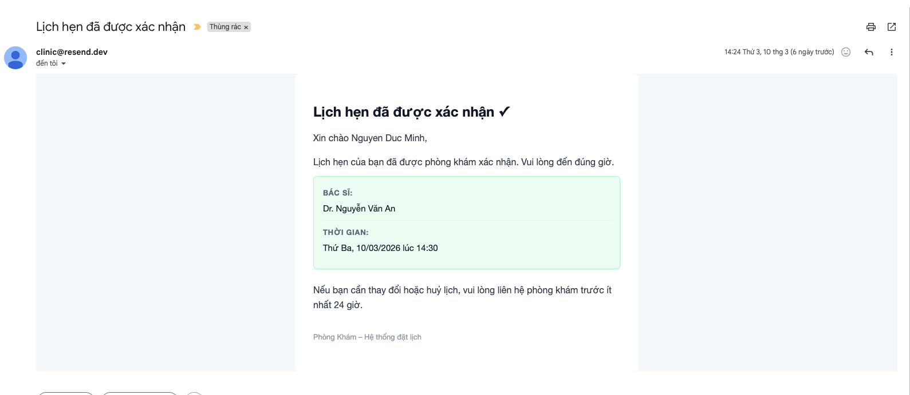

- **Mục đích:**: Đặt lịch thành công
- **Preview:**
  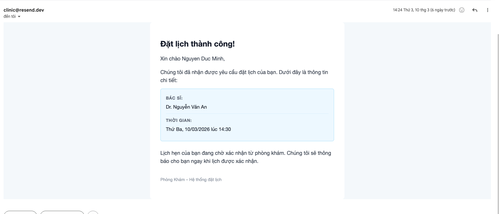

- **Mục đích:**: Huỷ lịch
- **Preview:**
  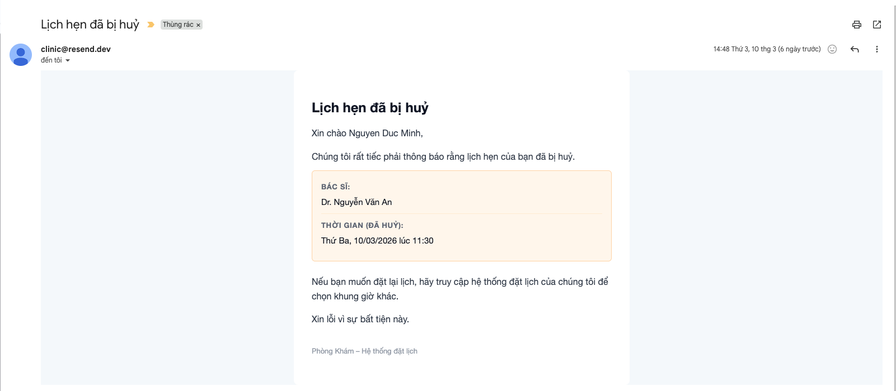

### Dashboard tổng quan bác sĩ

## Các page chưa có screenshot riêng

Hiện bộ ảnh chưa bao phủ riêng cho các route sau:

| Route                              | Lý do chưa có ảnh riêng                                                             |
| ---------------------------------- | ----------------------------------------------------------------------------------- |
| `/my-appointments/[id]/reschedule` | Route động đã redirect theo dữ liệu thực tế khi chụp                                |
| `/dashboard/patients/[patientId]`  | Chưa mở trực tiếp một hồ sơ bệnh nhân cụ thể trong phiên chụp                       |
| `/` tại `src/app/page.tsx`         | Có khả năng là entry point chuyển tiếp/trùng với public home, chưa tách ảnh độc lập |

## Gợi ý sử dụng tài liệu này

- Dùng khi review UI coverage theo từng vai trò.
- Dùng để đối chiếu giữa route trong `src/app` và ảnh chụp thực tế.
- Dùng làm mục lục nhanh khi cần demo hệ thống cho stakeholder.
- Nếu cần hoàn thiện 100% coverage, nên chụp bổ sung 4 route còn thiếu ở trên.
